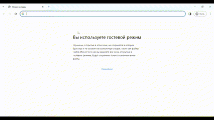

# Simple web app with popups



## Running locally

1. Get access to be able to run with docker compose:

    ```shell
    $ sudo chown -R $USER:$USER .
    ```

2. Run the docker compose:

    ```shell
    $ cd backend/
    $ docker compose up
    ```
3. Since your PostgreSQL would be empty, populate it from the back-up (note that it is applicable only if your DB is empty):

    ```shell
    $ cd backend/
    $ docker compose exec -T db psql -U postgres -d postgres < spacedb_dump.sql
    ```

4. (Optional) To create a back-up of your PostgreSQL:

    ```shell
    $ cd backend/
    $ docker compose exec -t db pg_dump -U postgres -d postgres > spacedb_dump.sql
    ```
5. Open `home.html` on the browser.